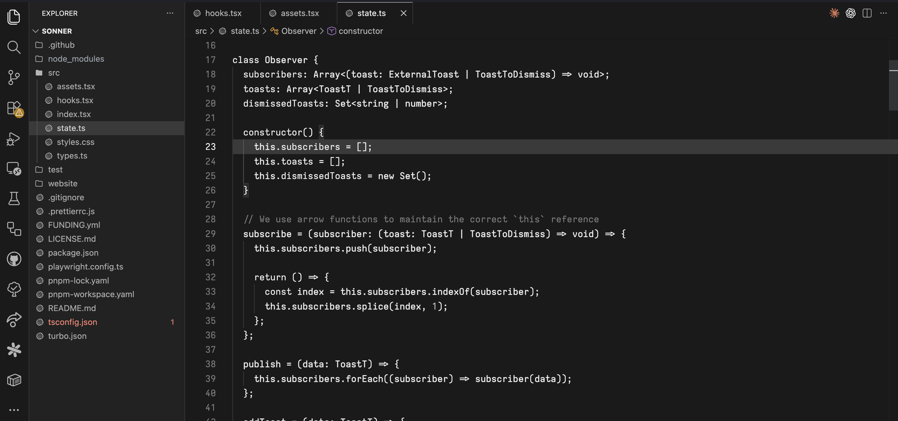
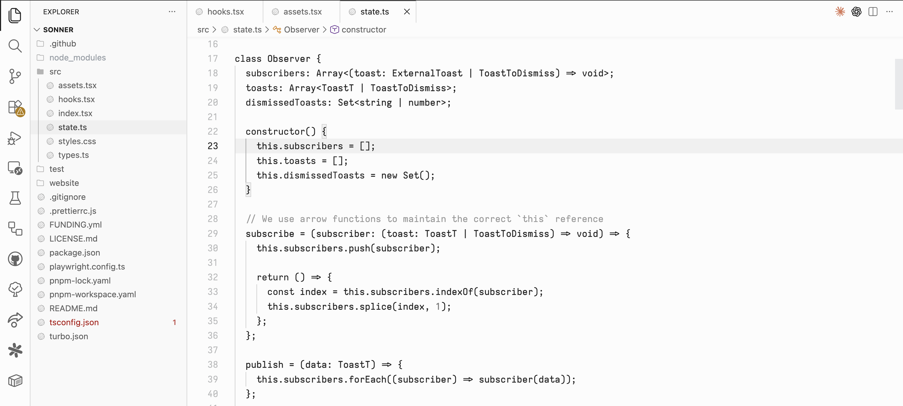
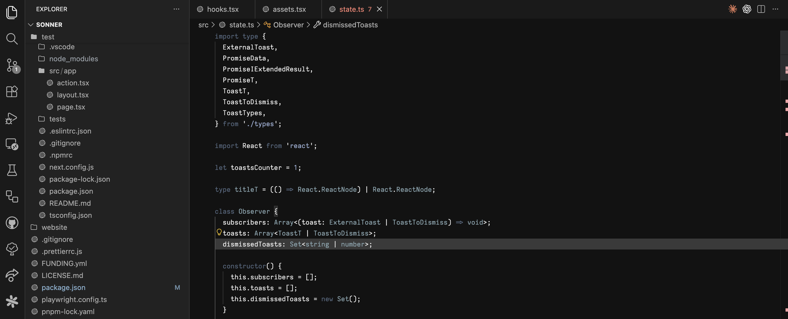
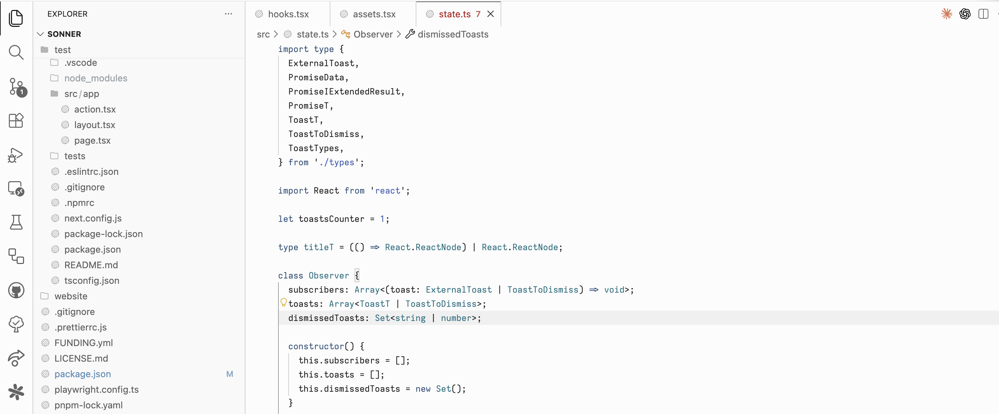

# Minimal Monochrome

Four quiet VS Code themes — two fully grayscale, two with a muted slate palette. All share the same minimal UI chrome with soft pastel accents for errors, warnings, git, and terminal.

## Monochrome Dark

No syntax color at all. Every token is a shade of gray. Structure comes from contrast alone.



## Monochrome Light

The same grayscale approach on a near-white background.



## Slate Dark

Heavily inspired by [egoist's Slate theme](https://github.com/egoist/vscode-theme-slate). Adds a restrained slate color palette to syntax tokens — blues, teals, and muted greens — while keeping the same dark UI. Useful when you want _some_ color differentiation without the visual noise of a typical theme.



## Slate Light

The slate palette adapted for a light background with higher saturation to maintain readability.



## Companion icons

[Minimal Monochrome Icons](https://github.com/arihantverma/minimal-monochrome-vscode-icons) — a matching monochrome icon theme.

## Recommended settings

```json
{
  "editor.bracketPairColorization.enabled": false
}
```

Bracket colorization adds rainbow colors that clash with both the grayscale and slate themes. Turning it off keeps the feel consistent.

## Credits

Monochrome themes ported from [tdfirth's Minimal theme](https://zed-themes.com/themes/-C_bTZ6lXwgXHHVcGmutv?name=Light) for [Zed](https://zed.dev). Slate variants heavily inspired by [egoist's Slate theme](https://github.com/egoist/vscode-theme-slate).

## License

[MIT](LICENSE)
